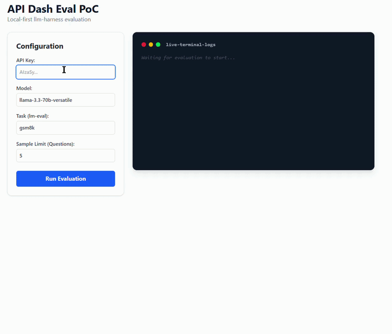

# Multimodal AI Evaluation Framework

A local-first, full-stack web dashboard for evaluating AI models across **Text, Vision, Audio, and Agentic** tasks — built as a Proof of Concept for the [API Dash](https://github.com/foss42/api-dash) Google Summer of Code (GSoC) initiative.

> **Why this exists:** Running LLM benchmarks is painful. Evaluation engines like `lm-eval` and `inspect-ai` have massive, conflicting dependency trees, produce wildly different output schemas, and crash in unpredictable ways. This framework wraps them behind a clean web interface with a unified data contract — so you can run evaluations, watch logs stream in real-time, and read results without touching a terminal.



---

## How It Works

The core architectural decision is the **Subprocess Adapter Pattern**. Instead of loading evaluation engines into the server's own memory, every benchmark runs in an isolated OS process. This means:

- **No dependency collisions** — `lmms-eval` (Hugging Face ecosystem) and `inspect-ai` (UK AISI ecosystem) never share a memory space.
- **No server crashes** — if an evaluation process hits an OOM error, the FastAPI server stays up.
- **4GB VRAM friendly** — designed to run on consumer hardware (e.g., RTX 3050 laptops).

### The Evaluation Pipeline

```
┌──────────────┐    POST /api/evaluate    ┌──────────────┐    subprocess.Popen    ┌──────────────────┐
│  ConfigPanel │ ──────────────────────▶ │  eval_runner │ ─────────────────────▶ │  Engine Wrapper  │
│  (React UI)  │                          │  (FastAPI)   │                        │  (isolated proc) │
└──────────────┘                          └──────┬───────┘                        └────────┬─────────┘
                                                 │                                         │
                                                 │  SSE stream (line-by-line)              │ stdout
                                                 │                                         │
                                          ┌──────▼───────┐                        ┌────────▼─────────┐
                                          │  LogStream   │                        │  temp_results/    │
                                          │  (terminal)   │                        │  → JSON scrape    │
                                          └──────────────┘                        │  → [EVAL_RESULT]  │
                                                                                  │  → shutil.rmtree  │
                                                                                  └──────────────────┘
```

1. **Frontend** — User picks a model and task. The Capability Matrix locks the form to valid combinations only (e.g., selecting `llava-phi3` disables everything except Vision tasks).
2. **Capability Router** — `eval_runner.py` resolves the task to the correct engine wrapper via `TASK_REGISTRY`.
3. **Subprocess Isolation** — The wrapper spawns as an independent OS process inheriting the virtual environment via `sys.executable`.
4. **Real-Time Streaming** — `stdout` is captured line-by-line and piped to the browser through Server-Sent Events (SSE).
5. **Result Scraping** — On completion, the wrapper parses its output JSON, emits a `[EVAL_RESULT]` sentinel, then **deletes its own temp directory** to keep the filesystem clean.

### The Unified Data Contract

All engines output the same schema, regardless of their internal format:

```typescript
interface EvalResult {
  run_id: string;
  model: string;
  modality: 'text' | 'vision' | 'audio' | 'agent';
  task: string;
  engine: 'lmms-eval' | 'inspect-ai' | 'faster-whisper';
  metrics: Record<string, number>;       // Primary scores (e.g., accuracy, exact_match)
  metadata?: Record<string, MetricDetails>; // Statistical details (stderr, norm variants)
  trajectory?: TrajectoryStep[];          // Step-by-step Agent timeline
}
```

The backend filters raw engine output at the source — primary metrics surface in `metrics`, while statistical noise (stderr, normalized variants) is paired with its parent metric in `metadata`. The frontend then displays confidence intervals (e.g., `20.0% ±4.0%`) instead of cluttering the view with separate cards.

---

## Supported Tasks & Models

| Modality | Task | Engine | Default Model | VRAM |
|----------|------|--------|---------------|------|
| **Text** | GSM8K, MMLU Pro | `lmms-eval` | `qwen2.5:1.5b` / `phi3:mini` (Ollama) | ~2GB |
| **Vision** | POPE | `lmms-eval` | `llava-phi3` (Ollama) | ~3GB |
| **Audio** | LibriSpeech | `faster-whisper` | `whisper-tiny` (Hugging Face) | <200MB |
| **Agent** | Basic Agent | `inspect-ai` | `qwen2.5:1.5b` (Ollama) | ~2GB |

All local inference runs through [Ollama](https://ollama.ai) (port 11434) except Audio, which uses `faster-whisper` with direct Hugging Face model loading.

---

## Proxy Middleware for Cloud APIs

`lm-eval` assumes every API behaves exactly like OpenAI. In practice, cloud providers reject non-standard parameters. The framework includes built-in proxy routes that intercept and sanitize payloads before forwarding:

| Provider | Route | Sanitization |
|----------|-------|-------------|
| **Google Gemini** | `/proxy/v1/chat/completions` | Strips `seed`, `presence_penalty`, `frequency_penalty` |
| **Groq** | `/proxy/groq/v1/chat/completions` | Strips `type` from messages, flattens vision-format content, removes `logprobs` |

This lets you evaluate cloud models (Gemini Flash, Llama 3.3 70B on Groq) without `lm-eval` crashing on vendor-specific schema validators.

---

## Project Structure

```
ai-eval/
├── backend/
│   ├── main.py                 # FastAPI app — endpoints, SSE streaming, proxy routes
│   ├── schemas.py              # Pydantic models — single source of truth for data formats
│   ├── eval_runner.py          # TASK_REGISTRY orchestrator — routes tasks to engine wrappers
│   └── engines/
│       ├── lmms_wrapper.py     # Text & Vision — wraps lmms-eval, filters metrics
│       ├── inspect_wrapper.py  # Agent — wraps inspect-ai, extracts scores + trajectory
│       └── audio_wrapper.py    # Audio — wraps faster-whisper on LibriSpeech
├── frontend/
│   └── src/
│       ├── App.tsx             # Dashboard scaffold, health checks, state management
│       ├── lib/api.ts          # TypeScript interfaces aligned with Python schemas
│       └── components/
│           ├── ConfigPanel.tsx # Model selector + Capability Matrix (locks invalid combos)
│           ├── LogStream.tsx   # SSE-powered live terminal with auto-scroll
│           └── Results.tsx     # Smart metric display — percentages, confidence, color coding
├── ARCHITECTURE.md             # Detailed technical architecture document
├── start.bat                   # One-command boot (Windows)
└── start.sh                    # One-command boot (Mac/Linux)
```

---

## Quick Start

### Prerequisites

- **Python 3.10+**
- **Node.js 18+**
- **[Ollama](https://ollama.ai)** running locally (for local model inference)

### One-Command Setup

Clone the repo and run the startup script — it handles virtual environment creation, dependency installation, and server launch automatically.

**Windows:**
```cmd
.\start.bat
```

**Mac/Linux:**
```bash
chmod +x start.sh
./start.sh
```

Open **http://localhost:5173** once both servers are running.

### Manual Setup

If scripts are blocked by local policies, use two terminal windows:

**Terminal 1 — Backend:**
```bash
cd backend
python -m venv venv
# Windows: venv\Scripts\activate
# Mac/Linux: source venv/bin/activate
pip install -r requirements.txt
uvicorn main:app --reload
```

**Terminal 2 — Frontend:**
```bash
cd frontend
npm install
npm run dev
```

### Using Cloud APIs (Optional)

For evaluating cloud-hosted models instead of local Ollama models:

1. Enter your API key in the dashboard (verified for **Gemini** and **Groq** keys)
2. Enter the corresponding model name (e.g., `gemini-flash-latest` or `llama-3.3-70b-versatile`)
3. The proxy middleware handles schema sanitization automatically

---

## Sample Results

| Model | Task | Score |
|-------|------|-------|
| Gemini 3.0 Flash | GSM8K (5 samples) | 20.0% Exact Match |
| Llama 3.3 70B (Groq) | GSM8K (5 samples) | 100.0% Exact Match |

---

## Tech Stack

| Layer | Technology |
|-------|-----------|
| Backend | FastAPI, Pydantic, Uvicorn, httpx |
| Eval Engines | lm-eval (v0.4), inspect-ai, faster-whisper |
| Frontend | React 19, Vite, TypeScript, Tailwind CSS v4 |
| Local Inference | Ollama, Hugging Face (whisper-tiny) |
| Real-Time | Server-Sent Events (SSE) |

---

## GSoC Context

This project was built as a Proof of Concept for the **API Dash** Google Summer of Code proposal. The goal is to demonstrate that a unified, local-first evaluation dashboard is feasible — one that:

- Runs entirely on consumer hardware (4GB VRAM target)
- Supports multiple evaluation engines through a common interface
- Handles the messy reality of different API schemas and provider quirks
- Presents results in a human-readable format (not raw JSON dumps)

The architecture is designed to be extensible — adding a new evaluation engine requires only a new wrapper script in `backend/engines/` and a `TASK_REGISTRY` entry.

---

## License

This project is developed as part of the GSoC program under the API Dash organization.

